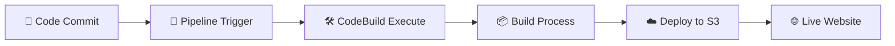

# 🚀 AWSpipline

<div align="center">

### ⚡ Modern Static Website CI/CD Pipeline on AWS ⚡

*Automated deployment of responsive static websites using AWS CodePipeline, CodeBuild & S3*


---

</div>

## 🎯 **Project Overview**

This repository showcases a **complete CI/CD pipeline** for deploying modern static websites to AWS S3 with automated builds, responsive design, and seamless integration between GitHub and AWS services.

## ✨ **Key Features**

| Feature | Description |
|---------|-------------|
| 🌐 **Static Website** | Modern, responsive HTML/CSS/JS frontend |
| ⚡ **CI/CD Pipeline** | Automated deployment via AWS CodePipeline |
| 🛠 **Build Automation** | CodeBuild executes custom buildspec configuration |
| 🔒 **Secure Hosting** | S3 bucket with optimized public access policies |
| 📱 **Responsive Design** | Mobile-first, cross-browser compatible |
| 🚀 **Fast Deployment** | Instant updates on code commits |

## 📁 **Repository Structure**

```
AWSpipline/
├── 📄 index.html          # Modern static website frontend
├── ⚙️ buildspec.yml       # AWS CodeBuild configuration
├── 📋 taskaws6.pdf        # Project documentation & notes
└── 📖 README.md           # This documentation
```

## 🔄 **CI/CD Workflow**



1. **Developer Push** → Code committed to GitHub repository
2. **Pipeline Activation** → AWS CodePipeline detects changes automatically
3. **Build Execution** → CodeBuild runs buildspec.yml instructions
4. **Artifact Generation** → Build process creates deployment-ready files
5. **S3 Deployment** → Files uploaded to configured S3 bucket
6. **Website Live** → Static site accessible via S3 endpoint or CloudFront

## 🛠 **Technology Stack**

<div align="center">

| **Frontend** | **AWS Services** | **DevOps** |
|:------------:|:----------------:|:----------:|
| HTML5 | S3 | CodePipeline |
| CSS3 | CodeBuild | CodeCommit |
| JavaScript | CloudFront | GitHub Integration |

</div>

## 🚀 **Quick Start**

1. **Clone Repository**
   ```bash
   git clone https://github.com/Abhi-mishra998/AWSpipline.git
   cd AWSpipline
   ```

2. **Configure AWS Services**
   - Set up S3 bucket for static website hosting
   - Create CodePipeline with GitHub source
   - Configure CodeBuild project with buildspec.yml

3. **Deploy**
   ```bash
   git add .
   git commit -m "Initial deployment"
   git push origin main
   ```

## 📊 **Performance & Monitoring**

- ⚡ **Fast Load Times** - Optimized static assets
- 📈 **AWS CloudWatch** - Pipeline monitoring & logs
- 🔍 **Build Status** - Real-time deployment tracking
- 📱 **Mobile Optimized** - Responsive across all devices

---

<div align="center">

### 💫 **Built with passion by [Abhishek Mishra](https://github.com/Abhi-mishra998)** 💫

*Transforming code into cloud-hosted experiences* ☁️


**⭐ Star this repo if you found it helpful! ⭐**

</div>
